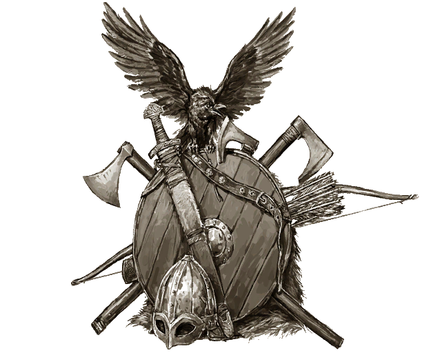
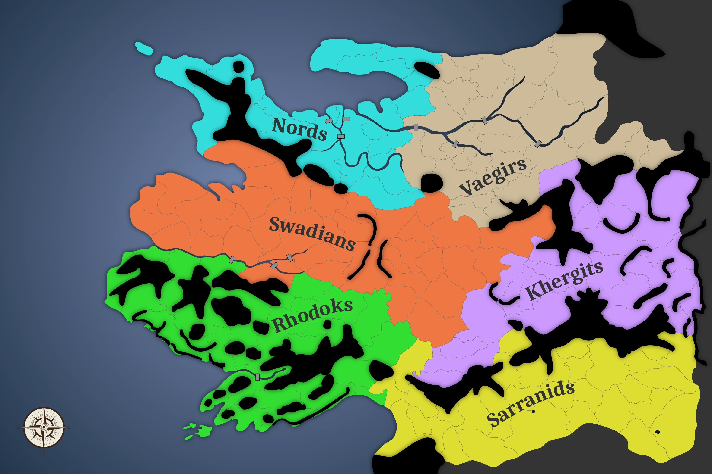

---
title: Conquest of Calradia
geometry: letterpaper,margin=2.54cm
indent: true
linestretch: 1.15
fontsize: 12pt
documentclass: report
colorlinks: true
toc: true
toc-depth: 1
...

# Overview

<figure></figure>

_Conquest of Calradia_ is a map based game set in the fictional world of [_Mount & Blade: Warband_](https://store.steampowered.com/app/48700/Mount__Blade_Warband/) known as Calradia. Players begin the game as rulers of factions in Calradia, and will hereafter often be referred to as factions.

The goal of _Conquest of Calradia_ is in its very name. Every faction seeks to gain control of the full game map. In order to do so, factions will need to conduct diplomacy with one another, navigate the internal politics of feuding lords, command armies across vast territories, and manage an intricate economic system.

Unlike most map games, which feature a neutral—and often biased—game master that decides the effectiveness of actions taken via roleplay, _Conquest of Calradia_ is almost entirely automated using a spreadsheet. While roleplaying is viable in _Conquest of Calradia,_ it's only as important as players want it to be. Chiefly, _Conquest of Calradia_ is a war game.

## Setting

As is aforementioned, _Conquest of Calradia_ is set in the world of Calradia. Calradia is a low-fantasy setting, meaning that it exists in a fictional world that closely resembles a real historical time period. For example, there is no magic or any fictional species in Calradia.

In Calradia there are six major cultures, all of which are featured in game and play a role. The cultures are:

- **Khergit.** In contrast to the lush heartlands of Calradia, the great steppes to the south are a vast region of dry grassland. With harsh weather and little resources, the one thing found in abundance here are the herds of horses that live both in the wild and domestically. It is in this arid waste that one can find the Khergits, a semi-nomadic group of hunters and horsemen who, much like their Steppe Horses, are lean, hardy, swift, and temperamental.
- **Nord.** In military terms, Nords are an infantry-based civilization. They boast the most powerful heavy shock infantry, whose main tactic is to throw a volley of axes or javelins at their targets before charging in to melee. They are somewhat vulnerable to armies with shock cavalry, as the men on foot cannot keep up with them. On the other hand, Nords are completely equipped to fight on foot and make for excellent castle besiegers, breaking shields and splitting heads with their axes as they go.
- **Rhodok.** The Rhodoks were originally part of the Swadians, but successfully fought a war for independence. Their origin is reflected in their troop types and choice of territory. The Rhodoks' pikemen and crossbowmen were fielded in mountainous terrain to defeat the Swadians, as they lacked cavalry and thus relied on pike and crossbow to prevail over the knights.
- **Swadian.** Forests, planes, and calm rivers are in the heartland of Calradia. Beset on all sides by other cultures of great military ambition, the Swadians are no strangers to defending themselves. Swadian knights are the most powerful cavalry units in the game, rivaled only by Sarranid mamlukes. Swadian troops rely mainly on the strength of their knights to power through all enemy formations.
- **Vaegir.** The Vaegirs possess arguably the finest foot archers in Calradia, and also have several tiers of reasonably good infantry and heavy cavalry. Vaegir troops prefer using two-handed weapons for an offensive advantage against their foes, and live in the mountainous and snowy north-eastern boundaries of the continent.
- **Sarranid.** The Sarranid territory is mostly open desert, making battles very favorable for cavalry and archers. Unlike the Khergits, their cavalry are melee only and have no bows, making them less versatile. However, their Mamlukes are some of the strongest in Calradia, rivaling Swadian knights. 

# Politics

Every town and castle in Calradia begins owned by a lord. When a faction takes control of a town or castle, they have the option to recruit that lord. A faction may declare a different lord to take possession of newly claimed territories, but otherwise it will be rewarded to whichever lord considers it home.

Although a faction can choose to dismiss a lord or otherwise strip him of any territories, lords are important for military purposes. Every lord is able to command a separate army on the map. The more lords a faction has, the more armies may be separately deployed.

Lords are multifaceted and have many different demands. In many cases, they will actually declare their complaints so that they be solved sooner.

## Lord Traits

All lords have a trait that makes them unique. They are as follows:

- **Administrator.** A skilled administrator is able to manage his holdings more efficiently. This lord's villages gain a 15% adjacency bonus instead of a 10% bonus.
- **Architect.** An architect sees ways to reduce the costs of public works. Village buildings and productive enterprises are half price in territories held by this lord.
- **Besieged.** A lord who has faced an extended siege knows how to defend his keep. The ranged damage of this lord's army is increased by +30% in defensive sieges.
- **Beserker.** A lord who participates in ancestral beserker traditions. Offensive infantry in this lord's command have -30% armor, but +40% damage. The beserker trait is unique to Nord lords.
- **Boastful.** A boastful lord lives to see his armies victorious. After victory in battle, a boastful lord gains more loyalty than others. (+20 loyalty)
- **Conqueror.** A conqueror has laid many famous sieges. Excluding any mounted units, his armies receives a +10% damage bonus in offensive sieges.
- **Crusader.** A crusader knows the weakness of his own position, and the importance of taking the fight to his enemies. When outside of Swadian territory, the terrain bonus of this lord's cavalry is increased by +30%. Additionally, crusader lords face only half loyalty penalty for being outside of their culture. A crusader trait is unique to Swadian lords.
- **Dignified.** A dignified lord enjoys the finer things in life. Manors are +50% more effective in territories held by this lord.
- **Entrenched.** Defense is second nature to this lord. This lord's ranged units have a +10% armor boost and an increased ranged damage of +30% in defensive sieges. An entrenched trait is unique to Rhodok lords.
- **Glutinous.** 24 hours in a day. 24 courses in a feast. Coincidence?  A glutinous lord gains additional loyalty from feasting. (20 loyalty)
- **Loyal.** A loyal lord does not fret in times of trouble and trusts his liege more than others. This lord receives a moderate loyalty bonus. (20 loyalty)
- **Eastern merchant.** The spice must flow. Eastern merchants receive twice as many spices in their villages. An eastern merchant trait is unique to Sarranid lords.
- **Merchant.** Whether by trade or marriage to a wealthy merchant's daughter, a merchant lord knows the ways of the market. For every merchant lord, a faction has one extra caravan.
- **Pillager.** A pillager hopes to see his enemies' villages burn. Armies under this lord's command gain a +10% damage bonus when attacking a village.
- **Rabble-rouser.** A rabble-rousing lord knows how to motivate the unwashed masses. All parts of this lord's army below the level of 10 will receive a +25% damage bonus. 
- **Selfless.** A selfless lord is not as envious of the holdings of other lords, and does not shy away from commanding a large army. Fief ownership is of halved importance to this lord, and he will be more loyal when commanding an army.
- **Warlord.** A warlord is a ravager of the steppes. A warlord's mounted units receive a +30% higher ranged damage when in an open battle in Khergit land. Outside of Khergit land, this bonus is reduced to 10%. A warlord trait is unique to the Khergit lords.
- **Wealthy.** Born to immense wealth, this lord grants an additional turn income of 500 denars.

## Lord Loyalty

All lords have a loyalty score. Loyalty is representative of how pleased a lord is with the current state of affairs. When loyalty is below 100, it affects the upkeep of armies under a lord's command. For however much below 100 a lord's loyalty is, his army will have to pay that much more upkeep. For example, a lord having 30 loyalty will result in his army costing 70% more.

A lord's loyalty is based on the following considerations:

1. **Does the lord own his home?** All lords have a home. If a lord owns his home, he gains a major loyalty bonus. (60 loyalty)
2. **Is the lord at home?** Lords are most comfortable at home. If a lord stays at home, he gains a minor loyalty bonus. (10 loyalty)
3. **Is the lord in one of his fiefs?** Lords prefer to stay within the territories that they own. If a lord stays in one of his own fiefs, including his home, he gains a minor loyalty bonus. (15 loyalty)
4. **Is the lord in his country?** Lords prefer to stay among their own kin. This is not a reflection of whether or not they are in their own faction's territory, but whether or not they are staying somewhere that shares their culture. If a lord stays in a territory of his own culture, he gains a moderate loyalty bonus. (20 loyalty)
5. **Is the lord in good company?** Lords are social creatures as well as reassured by the presence of their fellow nobles. If all lords of a faction are in the same territory, they all gain a moderate loyalty bonus. This bonus is only partial when not all lords are present. For example, three of five lords in a faction would receive 60% of the loyalty that five of five lords would receive. (20 loyalty)
6. **Does the lord own enough fiefs?** Lords are envious people, and as such will become jealous of other lords with greater territories. Lords are not unreasonable, however, and will only seek a portion of the territory representative of themselves among however many other lords are in a given faction. Lords will therefore be pleased when they believe they've been rewarded with more than their fair share. Lords will also become angry if they feel that they do not have as many fiefs as they should. If a lord has exactly the amount of territory as he sees just, he will be neither loyal nor disloyal. A lord will value a town more valuable than a castle, and a castle more valuable than a village. Two villages are considered more valuable than a castle, and two castles are considered more valuable than a town. Maintaining a balanced share of fiefs between lords can nullify any loyalty penalties. (-100 to 100 loyalty)
7. **What size is the lord's army?** Lords want to command armies that are proportional to their share of fiefs within a faction. A lord will be unhappy if he believes they have too large of an army to command for the small number of fiefs they have. A lord will also be unhappy if the thinks he has too small of an army for the vast number of fiefs he is charged with. Maintaining an army for each lord that is proportional to their fiefs will prevent lords from becoming disloyal. (-100 to 0 loyalty)
8. **Does the lord have any manors?** Manors may be built in villages for lords to gain a minor loyalty bonus. (5 loyalty each)
9. **What recent events have taken place?** Recent events can change a lord's loyalty for a period of time, including the following:
	- **Victories.** If a lord is victorious in a battle, he will gain a moderate loyalty bonus. (20 loyalty)
	- **Defeats.** If a lord is defeated in a battle, he will gain a minor loyalty penalty. (-10 loyalty)
	- **Lost fiefs.** If a lord's fief is captured or granted to another lord, he will gain a minor loyalty penalty. (-15 loyalty)
	- **Home besieged.** If a lord's home fief is attacked—regardless of whether the defense was successful—the lord will gain a major loyalty penalty. (-40 loyalty)
	- **Feasts.** Lords enjoy feasting, and the effects of a feast linger several turns longer than other events. (20 to 200 loyalty)

## Feasts

In order to improve loyalty temporarily, feasts may be thrown in any town with two or more lords present. For every lord in that town, the feast will cost their faction 5,000 denars. In addition, every lord in attendance will improve the feast's effects by 10 loyalty. For example, a feast declared in a town with six lords will result in a 60 loyalty bonus to all lords and cost 30,000 denars. A feast may grant no more than 200 loyalty.

Feasts may include lords from other factions, and all lords will count towards the loyalty bonus. Every faction must pay 5,000 denars for each of its own lords in a feast.

# Military

# Economics

The economic system of _Conquest of Calradia_ is the most complex part of the game system. The system relies on a relationship between villages, castles, and towns. Between these, goods are produced, improved, and transformed. In the end, all goods are turned into turn income.

Despite the many factors for calculating faction income, there are only a handful of ways for a faction to improve income:

1. **Conquering/claiming more villages.** Obtaining more villages is the easiest and simplest way of improving ones' economy. Gaining villages is almost guaranteed to improve ones' economy.
2. **Village buildings.** A few buildings can be built in villages, some of which, notably the mill and school, can easily improve a village's resource output and therefore faction income. Only one may be built in each village.
3. **Productive enterprises.** All towns are able to have a single productive enterprise. Productive enterprises convert the goods produced by a village into a refined good that is more valuable.

## Villages

The village is the backbone of the economy as well as its starting point. Ultimately, villages are the origin point of all wealth in the game. Every village produces a fixed minimum for each good. Villages seldom produce every resource, and most produce only a few. Factions have few options for their villages aside from deciding which Lord owns it and which building to construct.

### Village Buildings

There are four village buildings. All are purchased and built instantly, but only one may be built in each village.

Building	|	Cost	|	Effect
---			|	---		|	---
Barracks	|	8000	|	Recruitment cost reduced to 75.
Manor		|	12000	|	Lord's loyalty improved by 5.
Mill		|	10000	|	Increase minimum production to 3.
School		|	8000	|	Increase production by 20%.
Watch Tower	|	6000	|	No upkeep penalty for garrison.

Only the mill and school have a direct impact on any given village. A mill will improve all resources in a village from either 1 or 2 base production to a minimum of 3 total output. For example, a village that produces 2 fur, 1 iron, and 4 pottery will produce 3 fur, 3 iron, and 4 pottery after a mill has been built. A school will improve all outputs of a village by 20%, so the aforementioned village would instead produce 2.4 fur, 1.2 iron, and 4.8 pottery.

The manor relates to lords, the watchtower removes the upkeep penalty that armies face when outside of castles and towns, and the barracks reduces the cost of recruitment in that village.

## Castles

Villages are also impacted by castles, which serve as the seats of power for many lords in Calradia. If a lord owns a castle and its neighboring village, the adjacent village will be granted a +10% production increase. In fact, for every village adjacent to the castle, _all_ adjacent villages will be given a +10% production increase. A castle with three adjacent villages all owned by the same lord will, therefore, grant a +30% increased production to all of them. This effect is known as adjacency modifier.

Adjacency modifiers can also stack between castles. If the aforementioned lord owns a village that is adjacent to two of his castles, then he will receive bonuses from both castles and all of their respectfully adjacent villages.

Adjacency modifiers rely on the same lord having ownership of a territory, and it can therefore be useful to grant a lord a series of contiguous territories.

## Towns

Towns are important for two elements of the economy: productive enterprises and trade.

Productive enterprises are very costly, but can produce an immense amount of wealth by converting raw resources—those that are produced by a village—into refined resources. These conversions happen in bulk at the following productive enterprises:

Enterprise		|	Cost	|	Input				|	Output
---				|	---		|	---					|	---
Tannery			|	11000	|	10 hide				|	10 leather
Wool Weavery	|	11000	|	10 wool				|	10 cloth
Linen Weavery	|	11000	|	10 flax bundle		|	10 linen
Silk Weavery	|	21000	|	5 raw silk & 5 dye	|	10 silk
Ironworks		|	13000	|	10 iron				|	10 tools

If a productive enterprise is unable to meet the required input, it will attempt to produce as much as possible, but will operate at halved effectiveness. For example, if a tannery requires 10 hide, but the faction can only provide 7, then the tannery will output a mere 3.5 leather.

Towns are relevant to trade because every town enables a faction to send a caravan to trade with another faction.

## Trade

Factions offer trade agreements through a caravan limit, which is determined by how many towns a faction owns. Every town grants a single caravan, and therefore a single trade route offer. Trade routes are maintained until either one party ends it or the goods are no longer available to trade. If a faction has all of their caravans trading, they may still accept other people's caravans and trade routes.

## Going Rate

The going rate of goods is what determines how valuable they are and therefore turn income. Going rate is determined by three factors: ideal rate, market share, and fulfillment.

A going rate may never exceed the ideal rate of a good. An ideal rate is the maximum value of a particular type of good. They are listed here:

Good		|	Ideal Rate
---			|	---
Pottery		|	50
Hide		|	56
Wool		|	59
Flax Bundle	|	65
Dye			|	80
Salt		|	96
Iron		|	99
Fur			|	107
Raw Silk	|	200
Spices		|	284
Leather		|	275
Cloth		|	284
Linen		|	284
Silk		|	526
Tools		|	334

Market share is a percentage determined by how much of a particular good a faction produces out of the global production. If a faction produces 8 hide and the whole of Calradia produces 32, that faction has a hide market share of 25%. Dominating the market share for a particular good will result in a higher value.

Fulfillment is a representation of a population's general satisfaction in a faction. It is determined by how many of a particular good a faction has compared to other goods. Low fulfillment in one type of good will marginally reduce all others as well.

After market share and fulfillment are determined, they are averaged to find what percentage of the ideal rate the good has for its going rate. The going rate is then applied to all goods of being produced and they are all summed for turn income.

## Treasury

Every faction's treasury is fueled by turn income. If the unit upkeep of a faction has outpaced the turn income, the treasury will begin to shrink. While this happens, factions may continue to make new purchases of armies, buildings, enterprises, and so forth.

Should a faction's treasury become empty for more than a turn, however, then will enter a state of civil disorder. During civil disorder, the lowest loyalty lord of a faction will dessert every turn. If two lords have the same loyalty, then whichever one's home is alphabetically first shall dessert first. As previously stated, when a lord desserts, all armies under his command also dessert. If all lords dessert, the faction is defeated.